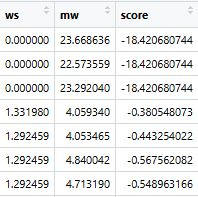
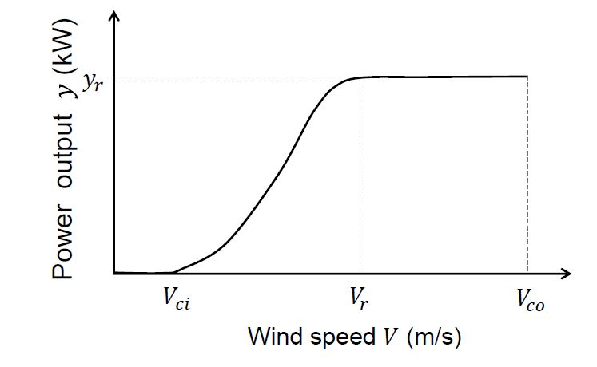
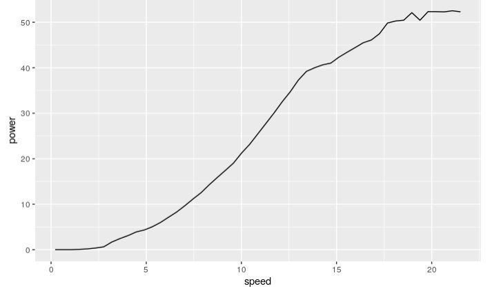
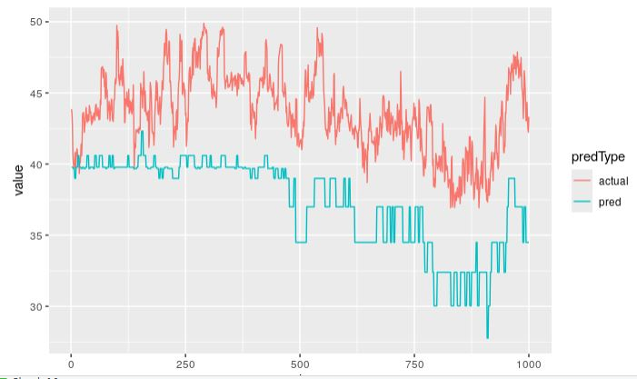
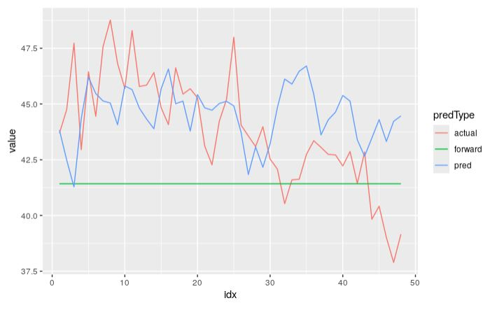
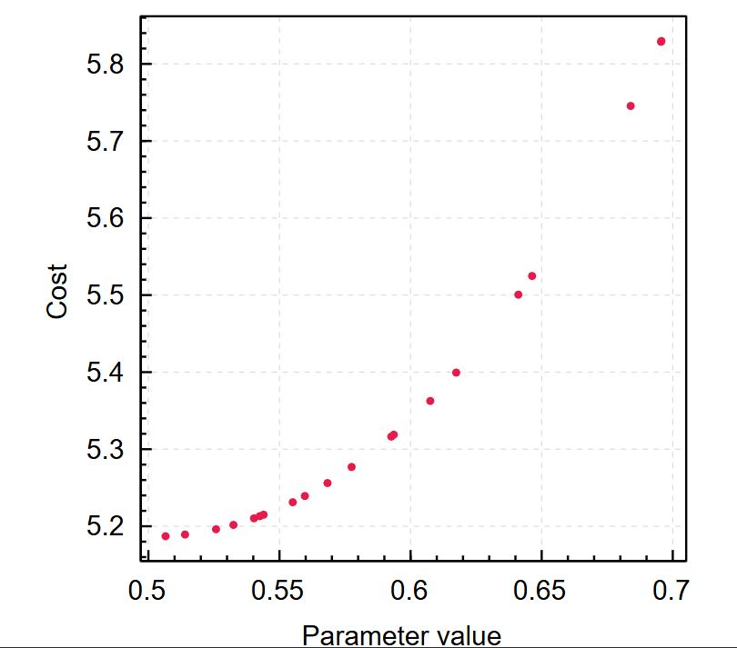
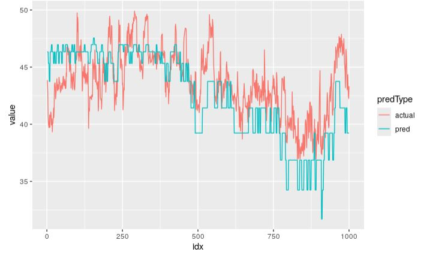

## Wind2Power
Wind2Power is a small library built to estimate power production output of a Wind farm. The principal application of the library is to perform **nowcasting**. This is achieved by building an approximation to the wind farm power curve from historical information (wind speed and power output).

### Features 
### 1.  Anomaly detection
It is not uncommon to encounter incomplete or erroneous observation in a historical dataset (of any kind). Thus, for instance one possible scenario is that the high power output is observed yet the corresponding wind speed is close to zero. Another use case might be having high wind associated with low power output possibly due to generator outage in a farm. The inclusion of these observations in the power curve estimation process might result in a distorted model. The tool provides a simple methodology to detect these cases and remove them from the dataset.
Wind speeds are non-negative and their distribution is right-skewed.  The Weibull distribution, although not the universal choice, is widely used to model wind speed. The Weibull distribution has two parameters, β, the shape parameter, that affects how skewed the distribution is and η, the scala parameter, that determines the concentration of the distribution. These parameters are unkown and they are determined by means of maximizing the likelihood. 
The log-likelihood is given by the expression: 

$$ L(β,η | W) = ηlnβ - βlnη + (β-1) \sum_{i=1}^nlnW_i - \sum_{i=1}^n(\frac{W_i}{n})^β$$

where W is the wind speed.

The following snippet shows how to use the library to fit a Weibull distribution from Wind speed data:

```scala
val filename = "data.csv"
val readInputFileProgram = for {
    stream <- ZIO.succeed(WindPowerObservation.fromFileName(filename)) //input stream from a file
    data <- WindPowerObservation.readAllFromFile(stream, 0, 2, 3, 4, 5) //materialize stream
    windStream = ZStream.fromIterable(data) //create another stream
    sample <- Statistics.systematicSample(windStream, 60).take(5000).runCollect //take a systematic sample
    ws = sample.map(_.windSpeed) //keep only the wind speed
    weibull = new Weibull(2.0, 2.0).fit(ws.toVector) //fit a Weibull using Maximum Likelihood
} yield weibull

val dist = unsafeRun(readInputFileProgram)
```

A convenient property of a Weibull random variable is that it remains Weibull if raised but reparameterized with β/m and $η^m$.  Power output of a wind turbine is generally well approximated by wind speed cubed (wind speed to the power of 3). Therefore, the (reparameterized) Weibull distribution can be used to model the wind farm power output.
Given an observation (wind speed & output power) we can calculate a score given by the log of the ratio of the CDF of observing the particular wind speed and the CDF of the particular power output. This score can take both negative and positive values. Large positive values indicate strong winds but very low power output while negative score would indicate power output but wind speeds close to zero. 
The utility function <i>sinkWithScores</i> takes an input file and produces an output file that is identical to the input but contains scores calculated using the methodology described. Both input and output files should be comma separated and the indexes passed to the function represent the column indexes of the timestamp, wind direction, wind speed, power output and a flag that indicates whether the power output of the wind farm was curtailed or not (1 or 0).
```scala
unsafeRun(sinkWithScores(filename, outFile, model, 0, 2, 3, 4, 5))
```
A sample of the output scores is shown in the figure below:


 
### 2. Power curve estimation

The estimation of the power curve consists of two steps:

Step 1:
- Initialize a model of type <i>SimpleKNN</i> by specifying a parameter K which should be n positive integer value. 
- Fit the model by passing it the historical data (wind-power observations). The fitted model is a lookup table where the keys are K discrete wind speed intervals and the values are all the observations grouped according to the specified intervals.

Step 2:
- After the model has been fit it is possible to extract a power curve by specifying a predictor.

An example is shown where the power curve is approximated using a Quantile predictor. The wind speed is equal to the midpoint of each interval and the estimated power output is obtained by taking the value for a specified percentile from the dataset that has been associated to the corresponding interval.

The code snippet below depicts how to estimate a power curve

```scala
val inputStream = WindPowerObservation.fromFileName(filename)
val program = for {
    population <- WindPowerObservation.readAllFromFile(inputStream, 0, 2, 3, 4, 5) 
    _ <- Console.printLine(s"Population length ${population.length}").orDie
    model = new SimpleKNN(0.0, 50) //fit a model with 50 bins. It is also required to pass some initial value for constructing the intervals, the default being 0.0.
    fittedModel <- model.fit(population.toArray)
    curve <- fittedModel.getPowerCurve()
} yield preds

//Provide the Predictor layer required by the getPowerCurve function
val runnable = program.provideLayer(QuantilePredictor.live(0.5))
```

An example of an estimated power curve (the theoretical curve shown on the left)

 

The choice of K (the number of intervals) affects the shape of the power curve. In reality, the estimated curve using the Quantile predictor is a step-wise approximation but it is possible to use different predictors to synthesize the power curve.

### 3. Power output estimation

Specify a predictor and run the predict method on a test dataset. The predict method will take the wind speed of each observation in the dataset, determine the interval that contains the measurement and execute the predictor. The lookup is a O(logN) operation and the predictions are parallelized using ZIO concurrency constructs, so the process is efficient.

```scala
val inputStream = WindPowerObservation.fromFileName(inputFile)
val program = for {
    population <- WindPowerObservation.readAllFromFile(inputStream, 0, 2, 3, 4, 5) 
    _ <- Console.printLine(s"Population length ${population.length}").orDie
    model = new SimpleKNN(0.0, 50)
    fittedModel <- model.fit(population.drop(1000).toArray)
    dataSub = population.take(1000).toArray
    preds <- fittedModel.predict(dataSub.toArray)
} yield preds

```

A plot of the actual values vs predictions is shown in the figure below:



### 4. Short term prediction

The library provides the capability to make very short-term predictions (typically 3-5 hours ahead) using recent history of power output (i.e. ignoring wind speed). One reason for doing this is that there mey not yet be sufficient data to construct an estimate of the power curve.

There are two models available: an Autoregressive model of order 2 and a Bayesian Structural Time Series model with local level and trend. The first is fit using maximum likelihood and BSTS using Hamiltonian Monte Carlo. This means that the AR model is very fast and BSTS slow, as the number of parameters in BSTS is approximately double the size of the time series used. As bboth models are generative it is possible to predict an arbitrary number of steps ahead. The snippet below shows how to use the AR2 model, where only 12 data points are sufficient to estimate the AR2 parameters and then generate predictions for 48 steps ahead:

```scala
val y = ??? //A univariate time series
val yTrain = y.take(12) //Fit the model using only 12 data points
val yTest = y.drop(12).take(48) //Take the next 48 data points to compare with the outputs of the generative model
val model = AR2(yTrain.toList).fit()
val yhat = model(48) //generate 48 predictions ahead 
```

The plot below shows a sample of actual power, predictions from AR2 and a straight line that depicts the first value of the time series carried forward for its duration (also known as naive forecast).



### 5. Black-box optimization

Irrespectivaly of the type of the model that is used it is always the case that some parameter values have to be defined before the model is fit, and they do not constitute part of the optimization process. For example, if the case of power estimation using the quantile predictor there exist two parameters that have to defined: K, the number of intervals, and the percentile p. The first takes discrete integer values and the second is a continuous variable $\epsilon$ (0.0, 1.0).
The most common methodology to determine the optimal setting is to try values from a pre-specified grid or draw random samples from a predefined multideimensional sample space $\Omega$.
Although it has been empirically shown that the second works better, both these methods suffer from the same three caveats: the process is purely explorative driven and multiple evaluations are commonly required making the process costly to run, and the third is curse of dimensionality as the number of evaluations grows exponentially with the size of the parameter space.

An alternative is to use an informative method that tries to balance exploration and exploitation (which means that it will explore space but at the same time it will focus in local areas of the space that are known to produce good results). One of these methods is Bayesian optimization, which works well and is very efficient for optimizing continuous parameters. The reason it does is that process uses two key components: a surrogate function (commonly a Gaussian Process Regression) and an acquisition function that is used as a parameter proposal mechanism. The process consists of two loops: an inner loop that optimizes the acqisition function and at the end of the optimization yields a proposal, and an outer loop where the proposal is taken, and an actual model is fit and evaluated. The evaluation results of the outer loop will be used to update the GPR (hence the Bayesian term).

The figure below shows the results of one-dimensional search of the optimal percentile value.



And the code snippet to produce this:

```scala
  val cleanFile = "data.csv"
  val inputStream = WindPowerObservation.fromFileName(cleanFile)
  val trainTestSplit = ZLayer.fromZIO{
    for {
        population <- WindPowerObservation.readAllFromFile(inputStream, 0, 2, 3, 4, 5)
        dataStream = ZStream.fromIterable(population).map(o => (o, 0))
        sampler = new TrainTestSplit(dataStream, 0.95)
    } yield sampler
  }

  val problem = QuantileOptimizationProblem.live(50)
  val ei = Acquisition.live[LowerConfidenceBound](Array((0.7, 0.99)), 0.0)

  val solution = for {
    problem <- ZIO.service[QuantileOptimizationProblem]
    parameters <- Ref.make(List.empty[Array[Double]])
    measurements <- Ref.make(Array.empty[Double])
    acq <- ZIO.service[Acquisition]
    solver = new BayesianOptimization(problem, 20, parameters, measurements, 0.15)
    chain <- solver.optimize(20)
  } yield chain

  val problemLayer: ZLayer[Any, Throwable, QuantileOptimizationProblem] =
    trainTestSplit >>> QuantileOptimizationProblem.live(50)

  val eiLayer: ZLayer[Any, Nothing, Acquisition] =
    Acquisition.live[LowerConfidenceBound](Array((0.5, 0.9)), 0.0)

  val fullLayer: ZLayer[Any, Throwable, QuantileOptimizationProblem with Acquisition] =
    problemLayer ++ eiLayer

  val programFinal = solution.provideLayer(fullLayer)

  val chain = unsafeRun(programFinal)

```

To optimize the discrete parameter K, a one-dimensional grid of values would be sufficient. A typical forecasting result using an optimized power curve is shown below.



TODO:

- [ ] Fit a linear model for each interval instead of taking a quantile. This will yield a peice-wise lienar approximation of the curve instead of a step wise.
- [ ] Provide the capability to do probabilistic forecasts.
- [ ] BSTS is a linear Gaussian state-space model and this means latent states can be analytically integrated out using a Kalman filter. This will dramatically reduce the effective size of the parameters HMC has to sample.
- [ ] Write code to serialize the models, the power curves and the prediction outputs.
- [ ] Turn this into a command line application.